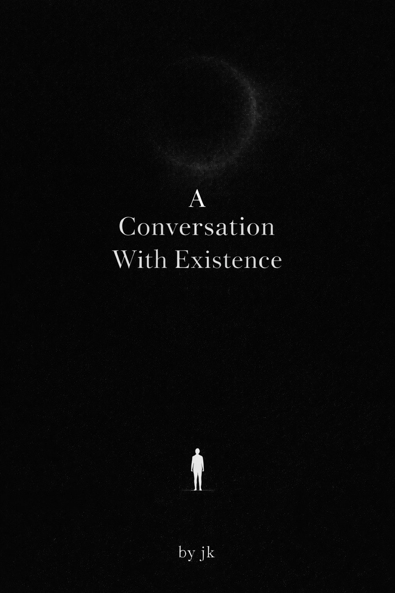

# A Conversation With Existence

**by Jeevan Siddhabhaktula**

---

> *"For the seekers, the silent thinkers, and anyone who has ever paused to wonder about their place in the universe."*

---

## 📖 [Read it online](https://jeevan-0508.github.io/a-conversation-with-existence/) — free, no download

## About the Book

*A Conversation With Existence* is a philosophical memoir that began with a single question about consciousness on an ordinary evening — and unfolded into a deep exploration of what it means to be human.

This book does not offer answers. It traces the questions.

Across **18 chapters** and **19 interludes**, it explores:

- **Consciousness** — what makes experience feel personal, fragile, and mysterious
- **Patterns** — the invisible loops that shape behavior, identity, and outcomes
- **The Weight We Carry** — pressure, expectation, and the shift from performing to grow to performing to prove
- **Time** — how we construct reality and the self from limited perception
- **The Self That Watches the Self** — the part of you that watches thoughts without becoming them
- **The Many Versions of You** — identity as fluid, not fixed
- **Destiny, Chance, and Death** — what we are, inside something we do not fully understand
- **AI and Consciousness** — when intelligence begins to mirror awareness
- **The Unknown** — God, aliens, and the questions that refuse to end

Woven between chapters are 19 **Interludes** — short poetic reflections that give the ideas space to breathe.

164 pages · ~21,000 words.

---

## Table of Contents

| Ch. | Title | |
|---|---|---|
| 1 | The Question That Started Everything | *Where silence breaks into the first thought.* |
| 2 | The Universe Waking Up Through You | *What if awareness is not yours — but happening through you?* |
| 3 | Maya and the Illusion We Live In | *Seeing what was always there — but never noticed.* |
| 4 | The Pattern of Life | *The invisible loops shaping everything you call "choice."* |
| 5 | The Weight We Carry | *The things you hold that were never truly yours.* |
| 6 | Moments That Change Us | *The smallest shifts that redefine everything.* |
| 7 | Time: The Scale of the Universe | *Is time moving — or are you?* |
| 8 | The Self That Watches the Self | *Who is the one noticing your thoughts right now?* |
| 9 | The Many Versions of You | *You were never just one person.* |
| 10 | Awareness and the Quiet Mind | *The space where everything appears — and disappears.* |
| 11 | The Life That Keeps Returning | *Does anything truly end — or only change form?* |
| 12 | Destiny and Randomness | *Are you choosing — or unfolding?* |
| 13 | Destiny, Chance, and the Path You Walk | *A second pass at the same question, from a different angle.* |
| 14 | Death and Immortality | *What leaves… and what remains.* |
| 15 | Spiritual Science | *Two languages trying to describe the same mystery.* |
| 16 | Cosmic Loneliness | *Alone… or part of something too vast to understand?* |
| 17 | AI and Consciousness | *When intelligence begins to mirror awareness.* |
| 18 | Alien Life, God, and the Truth | *The questions that refuse to end.* |

Followed by an **Epilogue**, **Acknowledgements**, **About the Author**, a **Note to the Reader**, and **Suggested Reading** (Rovelli, Greene, Hawking · Hood, Harris, Seth · Marcus Aurelius, Frankl, Harari).

---

## Formats

| | |
|---|---|
| 🌐 **Web** | [Read online](https://jeevan-0508.github.io/a-conversation-with-existence/) — free, works on any device, remembers your place |
| 📕 **EPUB** | [Download](./docs/book.epub) — for Kindle, Kobo, Apple Books |
| 📄 **PDF** | [Download](<./A Conversation With Existence - Final.pdf>) — print-formatted, with full illustrations |

---

## About the Author

**Jeevan Siddhabhaktula** works in risk management and lives at the intersection of patterns, uncertainty, and decision-making — both professionally and personally. He is a seeker: the kind of person who can get lost in a sunset, a question about consciousness, or a quiet thought that appears between breaths.

This is his first book.

---

## A Note

This is a living draft. The conversation continues.

---

*© 2025 Jeevan Siddhabhaktula. All rights reserved.*
